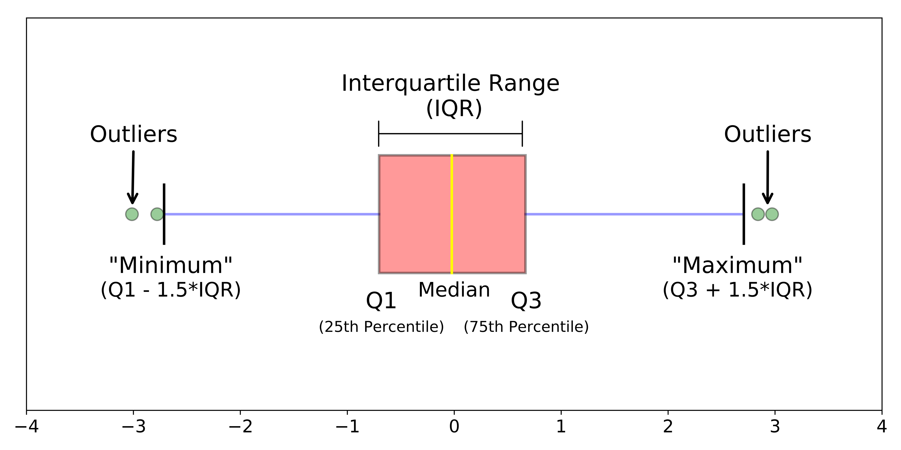

# Limpeza dos dados

A Etapa de Modelagem e Avaliações em Massa é iniciada com a limpeza dos dados
oriundos do Observatório do Mercado Imobiliário. Neste capítulo saõ apresentados
os métodos utilizados.

## Métodos de limpeza de dados

A limpeza de um conjunto de dados para fins de posterior ajuste de modelos 
estatísticas pode ser feita com a utilização de diversos métodos. São bem
difundidos especialmente os métodos univariados de identificação de *outliers*,
como o clássico método de *Chauvenet*, que presume a presença de distribuição
normal. Outros métodos univariados, por outro lado, são preferíveis pois 
prescindem da verificação da hipótese da normalidade e também são considerados
mais robustos, como o método do *boxplot*, que classifica como *outliers*
aqueles pontos que se encontram a uma distância de $1,5 \cdot \text{IQR}$ dos
primeiro e terceiro quartis ($Q_1 \text{ e } Q_3$)[^1]. A @fig-boxplot ilustra
graficamente o critério do *boxplot* para identificação de *outliers*:

```{r}
#| label: fig-boxplot
#| fig-cap: "Boxplot."

```


[^1]: Lembrando que $\text{IQR}$ é a medida de dispersão denominada de intervalo
interquartil, *i.e.* $\text{IQR} = Q_3 - Q_1$.

Neste projeto, porém, optou-se pela utilização de métodos multivariados para a 
limpeza dos conjuntos de dados, tal como o método dos mínimos quadrados aparados.
Tal método foi escolhido com o intuito de evitar a remoção desnecessária 
de muitos falsos *outliers* da amostra. Para entender, considere-se os
*bagplots* (ou diagramas de saco) das Figuras -@fig-bagplot e -@fig-bagplot2[^2].

[^2]: O *bagplot* é uma generalização do *boxplot* para duas dimensões, proposto
por @Bagplot1999, baseado nos conceitos de Profundidade de Tukey, ou 
Profundidade do meio-espaço e na mediana profunda, ou mediana bivariada [@Tukey1975].

Na @fig-bagplot podem ser vistos os diagramas de caixa de cada variável, às
margens do gráfico principal, em que é possível notar uma assimetria na amostra:
existe uma série de pontos à direita da distribuição de ambas as variáveis
classificados como *outliers* pelo critério do *boxplot* 
($Q_3 + 1,5 \cdot \text{IQR}$). O gráfico *bagplot* da @fig-bagplot, no entanto,
em que 50% dos dados se encontram dentro do primeiro *bag*, de cor mais escura,
e cuja área que separa os *outliers* dos *inliers* é exibida em cor cinza-clara,
mostra que apenas 4 pontos foram classificados como *outliers*. Note-se ainda 
que dois dos pontos classificados como *outliers* pelo critério do *bagplot* não
foram identificado pelo critério do *boxplot*.

Já na @fig-bagplot2, em que as variáveis explicativas apresentam distribuição
mais simétrica, pois as variáveis encontram-se transformadas para a obtenção da
normalidade, pode-se notar que o critério dos *boxplots* implicaria remover uma 
série de pontos em ambos os lados da distribuição das variáveis, enquanto o
critério do *bagplot* mostra que, novamente, apenas alguns pontos precisam de
fato ser removidos da amostra para uma boa modelagem.

```{r}
#| label: fig-bagplot
#| fig-cap: "Bagplot. Preços Totais"
library(wooldridge)
library(aplpack)
library(ggplot2)
library(ggthemes)
theme_set(theme_bw())
library(gggda)
library(ggExtra)
data(hprice1)
hprice1 <- within(hprice1, PU <- price/lotsize)
# bagplot(hprice1$sqrft, hprice1$price, show.whiskers = FALSE, dkmethod = 2,
#         las = 1,
#         xlab = "Área Construída (sq. feet)", ylab = "Preço (milhares de US$)",
#         main = "Bagplot - Preço de Venda vs Área Construída", pch = 19
#         )
plt0 <- 
  ggplot(hprice1, aes(x = sqrft, y = price)) +
  geom_bagplot(fraction = .5, coef = 3) +
  geom_point(pch = 16)  
ggMarginal(plt0, type = 'boxplot')
```

```{r}
#| label: fig-bagplot2
#| fig-cap: "Bagplot. Preços Unitários."
plt <- 
  ggplot(hprice1, aes(x = log(lotsize), y = log(PU))) +
  geom_bagplot(fraction = .5, coef = 3) +
  geom_point(pch = 16) 
ggMarginal(plt, type = 'boxplot')
```

```{r}
library(robustbase)
fit0 <- lm(log(PU) ~ log(lotsize), data = hprice1)
LTS <- ltsReg(log(PU) ~ log(lotsize), data = hprice1, alpha = .75)
hprice1 <- within(hprice1, w <- LTS$lts.wt)
fit <- lm(log(PU) ~ log(lotsize), data = hprice1, subset = -c(47, 77))
fit1 <- update(fit0, weights = LTS$lts.wt)
```

Os conceitos de profundidade estatística e mediana profunda podem ser estendidos
para outras dimensões. O algoritmo para o cômputo eficiente destas estatísticas
pode ser visto em @Struyf2000.

O método dos mínimos quadrados aparados, como veremos na próxima seção, ajusta
um modelo de regressão robusta a aproximadamente 50% dos pontos mais 
"importantes" da amostra, classificando como potenciais *outliers* os pontos 
que apresentam resíduos padronizados maiores, em módulo, a 2,5, calculados em
relação ao modelo ajustado com esses dados mais "importantes".

### *Breakdown point*

Segundo @Davies2007, uma das melhores medidas de robustez é o *breakdown point*
($\boldsymbol \epsilon^*$), conceito desenvolvido por @Hodges1967 e extendido 
por @Hampel1971 e @Donoho1983:

> The breakdown point is one of the most popular measures of robustness of
a statistical procedure. Originally introduced for location functionals (Hampel,
1968, 1971) the concept has been generalized to scale, regression and — with
more or less success — to other situations.

Grosso modo, o *breakdown point* de um estimador é o menor percentual de
dados contaminantes que levam o estimador a assumir arbitrariamente grandes
valores, ou valores aberrantes. Para compreender, tome-se o caso da estimação
da tendência central, $\mu$, de um conjunto de dados com distribuição 
supostamente normal. A média aritmética, $\bar x$, neste caso, é um estimador
com $\boldsymbol \epsilon^* = 0$, pois basta um dado amostral contaminante para
produzir estimativas totalmente equivocadas para o parâmetro. No outro extremo
encontra-se a mediana amostral, $\tilde x$, apresenta 
$\boldsymbol \epsilon^* = 0,5$, ou seja, a mediana é um estimador robusto para o
parâmetro central da distribuição, desde que menos de 50% dos dados amostrais
sejam contaminantes.

### Mínimos Quadrados Ordinários

Para melhor compreensão do método dos mínimos quadrados aparados, deve-se 
contextualizá-lo com o método clássico dos mínimos quadrados ordinários.

Seja então o modelo usual de regressão da @eq-LM, em que $\mathbf y$ é um vetor que 
contém uma **variável dependente** a ser explicada; $\mathbf X$ uma matriz que 
contém em suas colunas uma ou mais **variáveis explicativas**; e 
$\boldsymbol \beta$ é um vetor de coeficientes a ser estimado.

$$
\mathbf y = \mathbf X\boldsymbol \beta + \mathbf r
$$ {#eq-LM}

Então o método dos mínimos quadrados ordinários consiste na minimização de uma 
função  objetivo, $S$, nesta caso a função soma do quadrado dos resíduos, 
$S(\boldsymbol\beta) = \sum r_i^2(\boldsymbol\beta)$. Ou seja, no método dos
mínimos quadrados ordinários busca-se minimizar:

$$
\hat\beta_{\text{OLS}} = \min S(\boldsymbol \beta) = \arg \underset{\beta} \min\sum_{i=1}^n r_i^2(\boldsymbol \beta)
$$ {#eq-OLS}

Em que $\mathbf r$ é um vetor dos resíduos do modelo da @eq-LM, ou seja:

$$
\mathbf r = \mathbf y - \mathbf X \boldsymbol \beta
$$ {#eq-residuos}

Assim, a @eq-OLS poderia ser escrita, se uma maneira mais formal, em notação
matricial, como abaixo:

$$
= \arg \underset{\beta} \min\sum_{i=1}^n (\mathbf y - X\boldsymbol \beta)^2
$$ {#eq-OLS2}

Deste ponto em diante, contudo, para fins de simplificação do entendimento, 
adota-se a seguinte notação, reescrevento a @eq-OLS:

$$
\hat\beta_{\text{OLS}} = \arg \underset{\beta} \min \sum_{i=1}^n r_i^2
$$ {#eq-OLS3}

### *M-Estimadores*

Os métodos robustos consistem em variações em torno do processo de minimização
dos resíduos. Enquanto no método clássico dos mínimos quadrados ordinários é 
minimizada a soma do quadrado dos resíduos, no método dos mínimos resíduos
absolutos, proposto por @Edgeworth1887, baseado no método gráfico de 
Boscovich, tem-se:

$$\hat\beta_{\text{LAD}} = \arg \underset{\beta} \min \sum_{i=1}^n |r_i|$$ {#eq-LAD}

Segundo @Rousseeuw1984, o próximo passo no progresso dos métodos de regressão
robustos se deu com o surgimento dos *M-Estimadores*, baseados na idéia da 
aplicação de uma função, $\rho$, dos resíduos, diferente da função quadrática, 
como ilustrado na @eq-RLS. 

$$\boldsymbol{\hat\beta_{\text{RLS}}} =  \arg \underset{\beta} \min\sum_{i=1}^n \rho(r_i)$$ {#eq-RLS}

É fácil perceber que a intenção com os *M-Estimadores* foi contornar o fato que 
a função absoluto, $|r(t)|$, não possui propriedades desejáveis (não é uma 
função derivável em $t = 0$, o que dificulta o processo de minimização). Assim, 
@Huber1964 propôs inicialmente a aplicação da função da @eq-HLoss, que consiste
em utilizar, para os menores resíduos, em módulo ( $|r_i| \leq k$), a função 
quadrática e, somente a partir de um valor $k$ (ou seja, para $|r_i| > k$), a 
função absoluto.

$$
\rho_{Huber}(t) = \begin{cases}
\frac{1}{2} t^2 & |t| \leq k\\
k|t| - \frac{1}{2} k^2& |t| >k
\end{cases}
$$ {#eq-HLoss}

Diversas outras funções foram propostas para a @eq-RLS, como a função
*biweight* de Tukey. No entanto, tanto no método dos mínimos desvios absolutos 
da @eq-LAD, quanto nos *M-Estimadores*, persite à sensibilidade à presença de
*outliers* nas variáveis explicativas, *i.e.*, os *M-Estimadores* são eficazes
apenas em lidar com a presença de *outliers* na variável dependente (no caso, 
imóveis de valores observados muito mais altos ou mais baixos do que os que 
seria previstos pelo mercado). Desta forma, tanto o estimador MQO da @eq-OLS
como os *M-Estimadores* possuem *breakdown point* $\boldsymbol \epsilon^* = 0$.

### Mínimos Quadrados Aparados

Então @Rousseeuw1984, para contornar o problema dos *outliers* presentes nas 
variáveis explicativas, propôs dois estimadores robustos alternativos aos 
*M-Estimadores*: o estimador **LMS** (*Least Median of Squares*), que minimiza 
**a mediana** dos resíduos quadráticos (@eq-LMS), e o estimador LTS 
(*Least Trimmed Squares*, ou Mínimos Quadrados Aparados), que minimiza o 
quadrado dos resíduos, porém apenas para os "bons" pontos da amostra:

$$
\beta_{LMS} = \arg \underset{\beta} \min \mathrm{med \,} r_i^2
$$ {#eq-LMS}


$$
\beta_{LTS} = \min_{\beta}\sum_{i=1}^h (r^2)_{(i)}
$$ {#eq-LTS}

Em que $(r^2)_{(1)} < (r^2)_{(2)} < \ldots < (r^2)_{(n)}$ são os resíduos
quadráticos ordenados. Resumidamente: o estimador LTS da @eq-LTS utiliza
aproximadamente apenas $h$ pontos da amostra (em geral, $h \approx n/2$)
para um ajuste mais estável, e calcula os resíduos de cada ponto da amostra em
relação à esta reta de regressão robusta. Após o cálculo dos resíduos os pontos
são classificados como "bons" (pontos cujos resíduos padronizados são menores
que 2,5, em módulo) ou "ruins" (pontos cujos resíduos padronizados são maiores
ou iguais a 2,5). 

O estimador LTS é famoso por apresentar *breakdown point* igual a 50%
(máximo)[^3], isto é, contanto que menos de metade dos pontos do conjunto de
dados em análise consista de *outliers*, o algoritmo é eficaz em identificar
esses pontos anômalos e ajustar um modelo que reflete o padrão verdadeiro dos
dados.

[^3]: Quando são utilizados para o ajuste do modelo apenas aproximadamente 50%
dos dados, *i.e.*, quando $h = (n/2) + 1$.

Para ilustrar, o gráfico da @fig-LTSvsLS mostra como a presença de *outliers*,
especialmente aqueles dois pontos de maior e menor preço unitário, influenciam
a estimação do coeficiente angular do modelo, mostrando um efeito maior (reta
vermelha) do que o efeito "real" da variável área sobre os preços unitários 
(reta verde). Já a @fig-LTSvsLS2 mostra que o ajuste da reta de regressão linear
ordinária apenas aos pontos centrais (*i.e.*, sem a inclusão dos dois pontos
extremos supramencionados), seria já suficiente para a obtenção de um modelo bem
ajustado.

```{r}
# Cria elipse MCD:
library(dplyr)
library(MASS)
library(ellipse)
ellipse_data <-  hprice1 |>
  do({
    # Compute robust center and covariance
    robust_cov <- cov.trob(cbind(log(.$lotsize), log(.$PU)))
    
    # Generate the 95% confidence ellipse coordinates
    as.data.frame(ellipse(
      robust_cov$cov, 
      centre = robust_cov$center, 
      level = 0.95
    ))
  }) 
```


```{r}
#| label: fig-LTSvsLS
#| fig-cap: ""
ggplot(hprice1, aes(x = log(lotsize), y = log(PU))) +
#  geom_point() +
  geom_point(aes(colour = factor(w))) +
  geom_smooth(method = "lm", se = FALSE, lty = 2, aes(col = "LS")) +
  # geom_smooth(method = "rlm", method.args = list(method = "MM"),
  #              aes(col = "MM")) +
  geom_smooth(method = "lm", aes(weight = LTS$lts.wt, col = "LTS"), se = FALSE)
  # geom_path(data = ellipse_data, aes(x = x, y = y), linewidth = 1) +
```

```{r}
#| label: fig-LTSvsLS2
#| fig-cap: ""
ggplot(hprice1, aes(x = log(lotsize), y = log(PU))) +
  geom_point() +
  geom_smooth(data = hprice1[-c(47, 77), ],
              method = "lm", se = FALSE, lty = 2, aes(col = "LS")) +
  # geom_smooth(method = "rlm", method.args = list(method = "MM"),
  #              aes(col = "MM")) +
  geom_smooth(method = "lm", aes(weight = LTS$lts.wt, col = "LTS"), se = FALSE) +
  # geom_path(data = ellipse_data, aes(x = x, y = y), linewidth = 1) +
  scale_colour_manual(values = c("red", "blue"))
```

Neste caso, seria fácil estimar um modelo de regressão linear ordinária e 
identificar os dois pontos extremos e removê-los do modelo, obtendo assim um
modelo já mais confiável. No entanto, o estimador LTS ainda classifica como
*outliers* outros pontos da amostra, ilustrados em vermelho na @fig-LTSvsLS3,
melhorando assim o ajuste final do modelo. 

É importante destacar que não se trata de um processo para exclusão automática
de *outliers*, no entanto: a aplicação do algoritmo LTS não dispensa a análise
dos pontos classificados como *outliers* pelo avaliador, que deve decidir se
retira realmente todos os pontos *flagados* pelo algoritmo.

```{r}
#| label: fig-LTSvsLS3
#| fig-cap: ""
ggplot(hprice1, aes(x = log(lotsize), y = log(PU))) +
  geom_point(aes(colour = factor(w))) +
  geom_smooth(method = "lm", se = FALSE, lty = 2, aes(col = "LS")) +
  geom_smooth(method = "lm", aes(weight = LTS$lts.wt, col = "LTS"), se = FALSE)
```


### *MM-estimadores*

Os *MM-estimadores* foram primeiramente propostos por @Yohai1987.

Assim como o estimador de mínimos quadrados aparados, os *MM-estimadores* podem
apresentar o valor máximo para o *breakdown-point* (0,5), na condição em que
os resíduos tenham distribuição normal [@Yohai1987].

Segundo @Yohai1987, os *MM-estimadores* são obtidos em três estágios. No 
primeiro, um modelo de regressão robusta com alto *breakdown-point*, como o dos 
mínimos quadrados aparados, é estimado. Com o modelo obtido no primeiro estágio,
então, são computados os resíduos e, com estes, por sua vez, um estimador 
robusto de escala dos resíduos é obtido.

Neste projeto, o objetivo com a utilização dos métodos robustos é a mera 
limpeza dos dados, o que possibilita a utilização de outros métodos a posteriori
com mais segurança. Portanto, não foi adotada a utilização dos *MM-Estimadores**.

