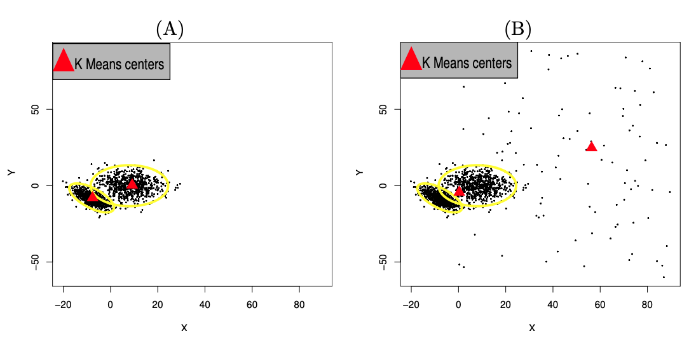

Para este projeto foram utilizados métodos robustos de classificação 
(ou *clusterização*). Assim como no caso da regressão robusta, é mais fácil 
compreender os métodos de classificação robusta quando comparámo-los aos métodos
clássicos de classificação, como o método *K-means*.

## *K-means*

O método *K-means* é um método de *clusterização* de dados que consiste na 
minimização da distância quadrática entre os pontos da amostras e *K* centros 
$\mu_1, \mu_2, \ldots, \mu_k$. Sejam as distâncias definidas conforme a 
@eq-distances abaixo

$$
D(\mathbf x_i,\boldsymbol{\mu_1}, \ldots, \boldsymbol \mu_K) = \min_{1\leq i\leq K} ||\mathbf x_i - \boldsymbol \mu_j||, \, 1\leq i, \leq k
$$ {#eq-distances}

Os centros dos clusters, dessa forma, são obtidos conforme a @eq-kmeans:

$$
(\boldsymbol{\hat \mu_1}, \ldots, \boldsymbol{\hat \mu_k}) = \arg\min\limits_{\boldsymbol{\mu_1}, \ldots, \boldsymbol{\mu_k}} \sum_{i=1}^n D^2(\mathbf x_i,\boldsymbol{\mu_1}, \ldots, \boldsymbol \mu_K)
$$ {#eq-kmeans}

O problema com o método *K-means* é que, a exemplo do que ocorre com o método 
dos mínimos quadrados ordinários, este método é muito sensível à presença de 
*outliers* [@Gonzalez2019, 2]. A @fig-kmeans (A) mostra que o método é eficiente
em estimar as k-médias, porém, na presença de *outliers* (@fig-kmeans (B)), os 
resultados ficam comprometidos.

{#fig-kmeans}

## *K-TAU*

```{r}
library(cluster)
library(factoextra)
library(ktaucenters)
library(sf)
st_layers("./data/4205407_Florianopolis_r007_2026-04-06.gpkg")
dados <- st_read("./data/4205407_Florianopolis_r007_2026-04-06.gpkg",
                 layer = "variavel_geografica_amostra_omi")
```

```{r}
library(appraiseR)
data(zilli_2020)
```


```{r}
fviz_nbclust(st_drop_geometry(zilli_2020[, c("PU", "AP", "ND", "NB", "NS", "NG")]), 
             kmeans, method = "wss")
```

```{r}
fviz_nbclust(st_drop_geometry(zilli_2020[, c("PU", "AP", "ND", "NB", "NS", "NG")]), 
             pam, method = "wss")
```

@Gonzalez2019 propuseram 

## *K-medoids*

*K-medoids* é um método robusto de *clusterização* que 

